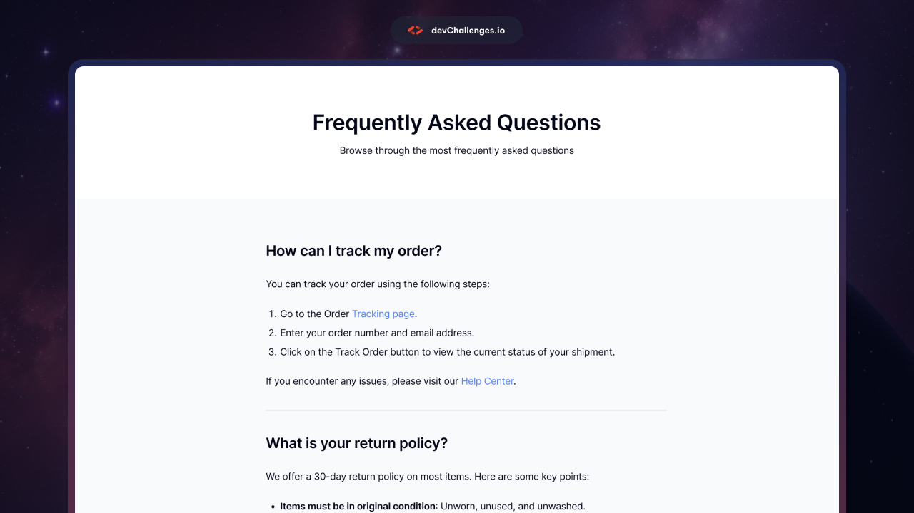

# DevChallenges.io - Simple FAQ Page




## Welcome! 👋

Welcome to this responsive web coding challenge.

[devChallenges.io](https://devchallenges.io/) challenges are designed to help you enhance your coding skills by building realistic projects.

**Suggested Skills to practice: HTML and CSS**

## About this project

This repository contains a simple FAQ / feedback page built as part of devChallenges.io. The goal is to reproduce the provided design and validate the HTML through a CI pipeline before merging into `main`.

## The challenge

Create a web page that closely matches the provided design assets and ensure the HTML is valid by using the included CI/CD pipeline. The pipeline validates HTML automatically on push and pull requests targeting `main`.

## Where to find everything

- Design assets (if included) are in the `/design` folder.
- Static assets (images, icons) are in `/resources` or the project root.
- The page entrypoint is `index.html` (update this if your main file is different).

## Local development

Prerequisites (if using Node-based tooling):
- Node.js >= 14
- npm or yarn

Install dependencies (if you have a package.json):
```bash
npm install
# or
yarn
```

Open index.html in your browser, or run a static server:
```bash
# with npm package http-server (install globally or as dev dep)
npx http-server .
```

## HTML validation (local)

The CI uses html-validate to check `index.html`. To run the same check locally:

```bash
# install html-validate locally or run via npx
npm install --save-dev html-validate
npx html-validate index.html
```

Or install globally:

```bash
npm install -g html-validate
html-validate index.html
```

Fix any reported issues before pushing changes to `main`.

## CI / CD

A GitHub Actions workflow was added: `.github/workflows/feedback.yml`

Key details:
- Triggers: push and pull_request on the `main` branch
- Runner: self-hosted (labels: `self-hosted`, `local-1`) — update runner labels if you do not use a self-hosted runner
- Steps:
  1. Checkout repository
  2. Set up Node.js (node 18)
  3. Install html-validate
  4. Run `html-validate index.html`
- If html-validate fails, the workflow stops and the PR / push will show a failing check.

Badge (shows workflow status):
```

```

If you want the workflow to run on GitHub-hosted runners, change the job `runs-on` value (for example: `runs-on: ubuntu-latest`) in `.github/workflows/feedback.yml`.

## Deployment

This repo is suitable for static hosting. Common options:
- GitHub Pages
- Vercel
- Netlify

If you want automated deployment, I can extend the workflow to build and deploy (for example, push build output to `gh-pages` or deploy with Netlify/Vercel).

## Steps to finish the challenge

- Recreate the layout and styles from the design (desktop, tablet, mobile).
- Ensure semantic HTML and accessibility where possible.
- Run html-validate locally, fix issues, and push changes.
- Open a PR — CI will validate HTML before merge.

## Contributing

1. Fork the repo
2. Create a branch: `git checkout -b feature/your-feature`
3. Commit and push
4. Open a Pull Request targeting `main`

The CI check will run automatically on your PR.

## License

Add your license here (e.g., MIT).

## Contact

Maintainer: @Kathyayini12

---
